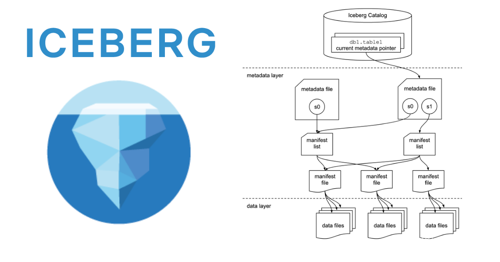

  <h1 align="center">Iceberg数据存储格式</h1>
  

    <a href="README.md"><strong>English</strong></a> | <strong>简体中文</strong>
  

## 目录

- [仓库简介](#项目介绍)
- [前置条件](#前置条件)
- [镜像说明](#镜像说明)
- [获取帮助](#获取帮助)
- [如何贡献](#如何贡献)

## 项目介绍
‌[Apache Iceberg‌](https://github.com/apache/iceberg) Apache Iceberg 是一种新型的用于大规模数据分析的开源表格式。它被设计用于存储移动缓慢的大型表格数据。它旨在改善 Hive、Trino（PrestoSQL）和 Spark 中内置的事实上的标准表布局。Iceberg 可以屏蔽底层数据存储格式上的差异，向上提供统一的操作 API，使得不同的引擎可以通过其提供的 API 接入。

**核心特性：**
1. 模式演化（Schema evolution）：支持 Add（添加）、Drop（删除）、Update（更新）、Rename（重命名）和 Reorder（重排）表格式定义。
2. 分区布局演变（Partition layout evolution）：可以随着数据量或查询模式的变化而更新表的布局。
3. 隐式分区（Hidden partitioning）：查询不再取决于表的物理布局。通过物理和逻辑之间的分隔，Iceberg 表可以随着数据量的变化和时间的推移发展分区方案。错误配置的表可以得到修复，无需进行昂贵的迁移。
4. 时光穿梭（Time travel）：支持用户使用完全相同的快照进行重复查询，或者使用户轻松检查更改。
5. 版本回滚（Version rollback）：使用户可以通过将表重置为良好状态来快速纠正问题。

**架构设计：**

本项目提供的开源镜像商品 [**Iceberg数据湖存储**](https://marketplace.huaweicloud.com)，已预先安装 Iceberg 软件及其相关运行环境，并提供部署模板。快来参照使用指南，轻松开启“开箱即用”的高效体验吧。

> **系统要求如下：**
> - CPU: 2GHz 或更高
> - RAM: 4GB 或更大
> - Disk: 至少 40GB

## 前置条件
[注册华为账号并开通华为云](https://support.huaweicloud.com/usermanual-account/account_id_001.html)

## 镜像说明

| 镜像规格                                                                                                                                 | 特性说明                                         | 备注 |
|--------------------------------------------------------------------------------------------------------------------------------------|----------------------------------------------| --- |
| [Iceberg2.1_HCE2.0](https://marketplace.huaweicloud.com) | 基于 鲲鹏服务器 + Huawei Cloud EulerOS 2.0 64bit 安装部署 |  |
| [Iceberg2.1_Ubuntu24.04](https://marketplace.huaweicloud.com) | 基于 鲲鹏服务器 + Ubuntu24.04 64bit 安装部署         |  |

## 获取帮助
- 更多问题可通过 [issue](https://github.com/HuaweiCloudDeveloper/Iceberg-image/issues) 或 华为云云商店指定商品的服务支持 与我们取得联系
- 其他开源镜像可看 [open-source-image-repos](https://github.com/HuaweiCloudDeveloper/open-source-image-repos)

## 如何贡献
- Fork 此存储库并提交合并请求
- 基于您的开源镜像信息同步更新 README.md
