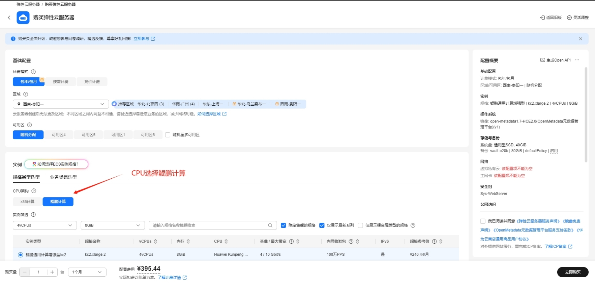
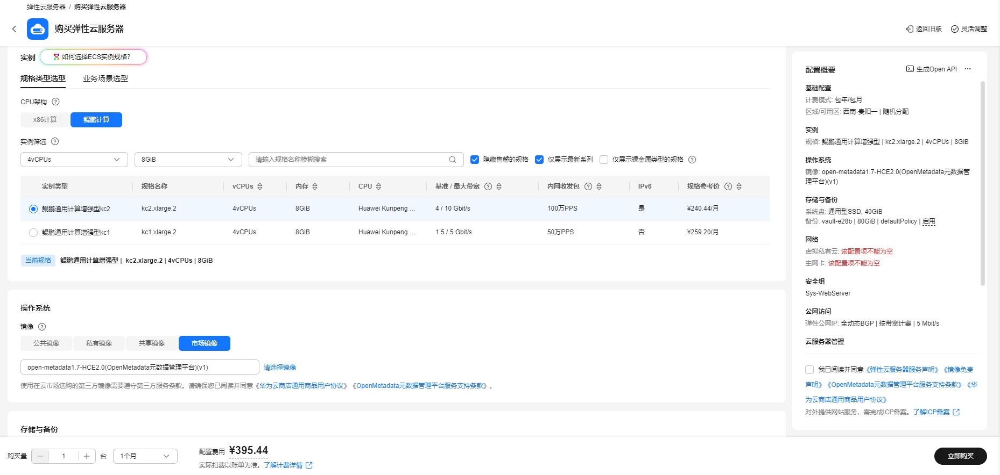
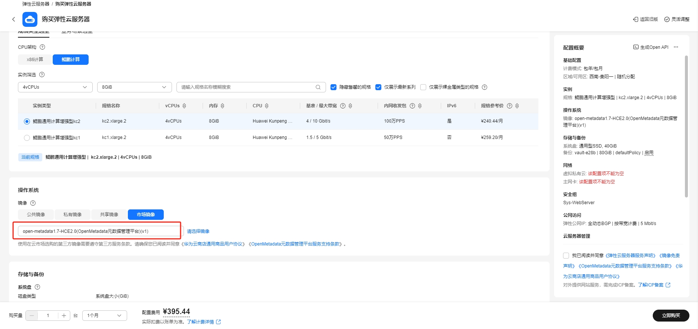
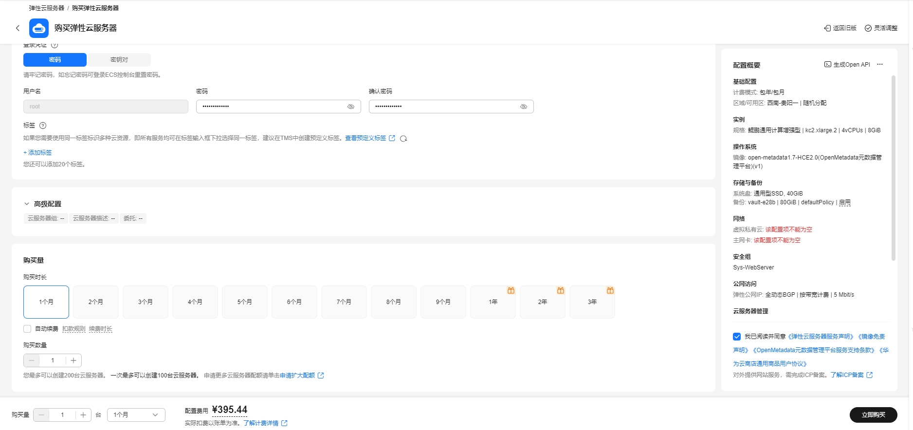

# Iceberg数据存储格式使用指南

# 一、商品链接

[Iceberg数据存储格式](https://marketplace.huaweicloud.com/)

# 二、商品说明

**Apache Iceberg** 是一种适用于大型分析表的高性能格式。Iceberg 将 SQL 表的可靠性和简单性引入大数据，同时使 Spark、Trino、Flink、Presto、Hive 和 Impala 等引擎能够安全地同时处理相同的表。

# 三、商品购买

您可以在云商店搜索 **Iceberg数据存储格式**。

其中，地域、规格、推荐配置使用默认，购买方式根据您的需求选择按需/按月/按年，短期使用推荐按需，长期使用推荐按月/按年，确认配置后点击“立即购买”。

## 3.1 使用 RFS 模板直接部署

必填项填写后，点击 下一步

创建直接计划后，点击 确定

点击部署，执行计划

如下图“Apply required resource success. ”即为资源创建完成

##  3.2 ECS 控制台配置

### 准备工作

在使用ECS控制台配置前，需要您提前配置好 **安全组规则**。

> **安全组规则的配置如下：**
> - 入方向规则 建议放通所有端口,如指定端口,对应的源地址内必须包含您的客户端ip，否则无法访问 
> - 入方向规则放通 CloudShell 连接实例使用的端口 `22`，以便在控制台登录调试
> - 出方向规则一键放通

### 创建ECS

前提工作准备好后，选择 ECS 控制台配置跳转到[购买ECS](https://support.huaweicloud.com/qs-ecs/ecs_01_0103.html) 页面，ECS 资源的配置如下图所示：

选择CPU架构

选择服务器规格

选择镜像

其他参数根据实际请客进行填写，填写完成之后，点击立即购买即可

> **值得注意的是：**
> - VPC 您可以自行创建
> - 安全组选择 [**准备工作**](#准备工作) 中配置的安全组；
> - 弹性公网IP选择现在购买，推荐选择“按流量计费”，带宽大小可设置为5Mbit/s；
> - 高级配置需要在高级选项支持注入自定义数据，所以登录凭证不能选择“密码”，选择创建后设置；
> - 其余默认或按规则填写即可。

# 四、商品使用

## 修改服务器域名
vim /etc/hosts  
x.x.x.x hadoop1  修改成本机服务器ip

## hadoop用户重新生成免密
删除文件  
su - hadoop  
cd .ssh  
rm -rf id_rsa  id_rsa.pub  known_hosts  

生成免密  
ssh-keygen -t rsa  
ssh-copy-id hadoop1		-- hadoop 密码 例如 123456  

## 启动hadoop服务器
/opt/module/hadoop-3.1.3/sbin/start-all.sh

## 使用hive
/opt/module/hive-3.1.3/bin/hive

### iceberg样例
创建iceberg表  
CREATE TABLE iceberg_test1 (id int,name string) STORED BY 'org.apache.iceberg.mr.hive.HiveIcebergStorageHandler';  

## 参考文档

[Iceberg官网](https://iceberg.apache.org/)
